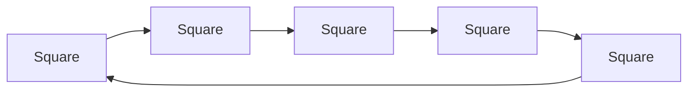

```mermaid 
graph LR;
    A[Square] --> B[Square]
    B --> C[Square]
    C --> D[Square]
    D --> E[Square]
    E --> A[Square]
```
[]: # Language: markdown
[]: # Path: meshes\src\objects\SQUARE.md
```
